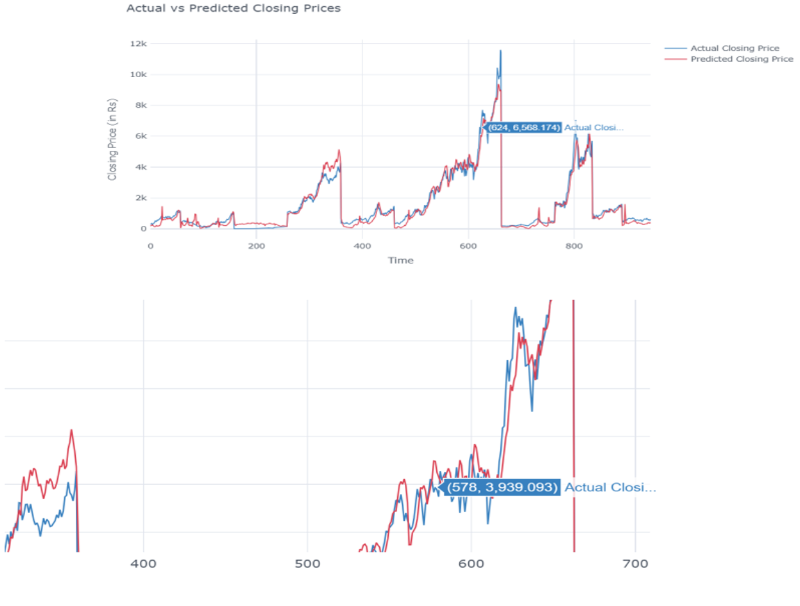

# Stock Price Forecasting using LSTM

## 📌 Overview
This project is a time series forecasting model that predicts the next month's adjusted closing price of Nifty 50 stocks using a Bidirectional LSTM neural network.

---

## 🧠 Model Architecture
- Input: 12 months of financial indicators per stock
- Layers:
  - Bidirectional LSTM
  - Dropout & BatchNormalization
  - Dense layers for prediction

---

## 📊 Features Used
- Technical Indicators: RSI, MACD, Bollinger Bands, ATR
- Monthly Returns: 1m, 2m, ..., 12m
- Rolling Averages: Traded Value, Volatility

---

## ⚙️ Training Details
- Loss: Mean Squared Error (MSE)
- Optimizer: Adam
- Epochs: 100 (with EarlyStopping)
- Batch Size: 64
- Validation Split: 20%

---

## 📈 Evaluation Metrics
- MAE, RMSE, R², MAPE

---

## 🖼️ Sample Output

